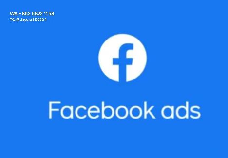

# Facebook广告内容创作与优化实战指南

---

## 一、广告账户架构策略
### 1.1 三层阶梯式账户体系
- **测试验证账户组**
  每日预算范围：$50-200，投放时段08:00-12:00
  素材规范：3组图片广告+2支15秒短视频
  淘汰机制：CTR<1.5%素材72小时下架

- **主力运营矩阵**
  包含精准受众账户($800/天)、拓展账户($300/天)、再营销账户($500/天)
  跨账户共享优质受众标签，自动同步热门素材[^1]

- **应急储备系统**
  设置预算自动补给机制
  配备3套备选素材组合

---

## 二、创意生产与优化流程
### 2.1 四步素材制作法
1. **需求拆解**
   创建包含产品卖点、用户痛点的脑暴矩阵
2. **元素拼配**
   结合热门文案模板生成5套设计方案
3. **动态测试**
   制作3个创意版本进行AB测试
4. **数据闭环**
   设置CTR/CVR关键指标警报系统

### 2.2 文案创作标准
| 要素            | 黄金法则                  |
|-----------------|-------------------------|
| 标题            | 突出数字+场景痛点        |
| 正文            | PAS结构排列             |
| 行动号召        | 带有紧迫感的动词组合     |
| 情感激发        | 第二人称叙述方式         |

---

## 三、智能广告投放策略
### 3.1 受众分层运营
| 用户层级 | 定位策略                | 创意类型            | 转化目标        |
|----------|-------------------------|--------------------|-----------------|
| L1       | 相似受众+兴趣关键词      | 轮播对比广告        | 商品加购        |
| L2       | 网站访客+行为定位        | 视频演示广告        | 表单提交        |
| L3       | 历史购买者               | 福利提醒广告        | 重复购买        |

### 3.2 动态预算调控机制
- **时段优化**
  早高峰时段(08:00-10:00)预算增幅30%
- **版位加权**
  Instagram Stories版位预算占比提升至40%
- **风险控制**
  设置CPM>$15自动熔断机制

---

## 四、效果监控与再营销体系
### 4.1 数据追踪仪表盘
构建包含以下维度的监控系统：
- **基础指标**
  CTR/CVR/ROAS实时趋势
- **用户路径**
  访问深度与关键节点流失率
- **成本分布**
  分版位CPM/CPC对比

### 4.2 再营销策略组合
1. **自定义受众建立**
   创建3天内加入购物车未支付的用户群体
2. **分层内容推送**
   未注册用户发送新客礼包
   未转化用户推送限时折扣
3. **PIXEL优化**
   设置购买完成后的排除受众

---

## 五、长期运营维护机制
### 5.1 素材生命周期管理
| 周期阶段 | 维护动作                | 质量标准            |
|----------|-------------------------|--------------------|
| 导入期   | 配置3组对比测试          | CTR≥1.5%           |
| 成长期   | 追加20%预算              | CVR≥2.0%           |
| 成熟期   | 生成变体扩大覆盖         | ROAS≥3.0           |
| 衰退期   | 终止投放并提炼元素       | CTR降幅>30%        |

### 5.2 账户健康诊断清单
- 每月更新兴趣关键词库
- 季度检视像素实施状况
- 半年重构转化漏斗路径
- 年审广告合规性记录
```
